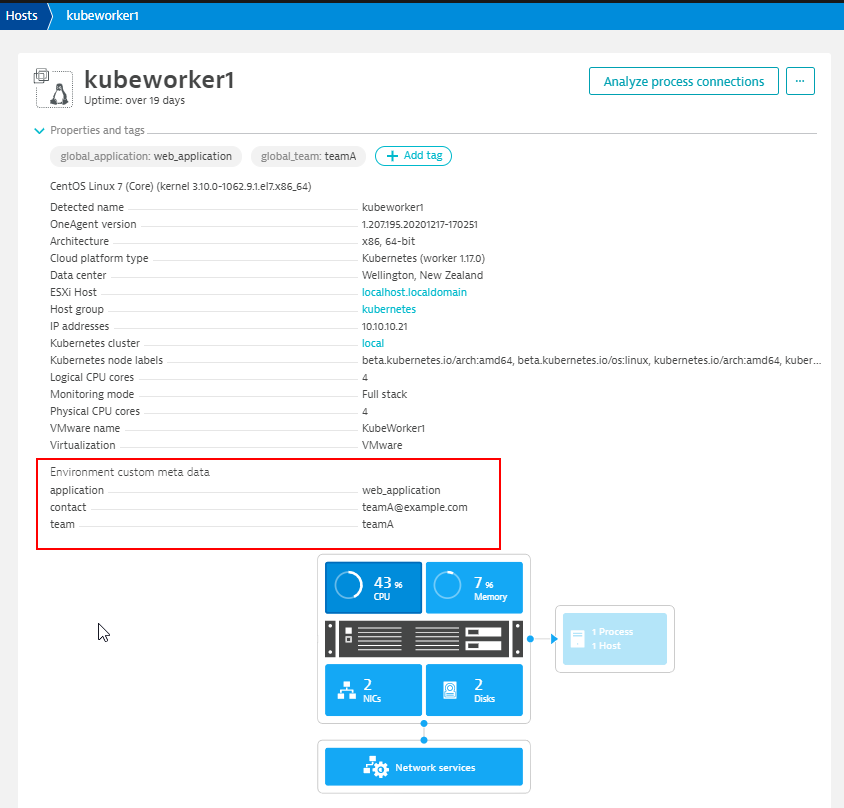
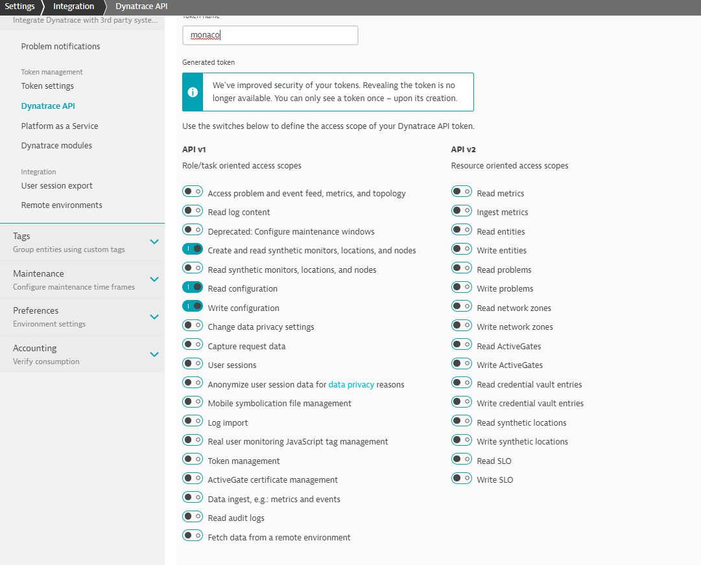
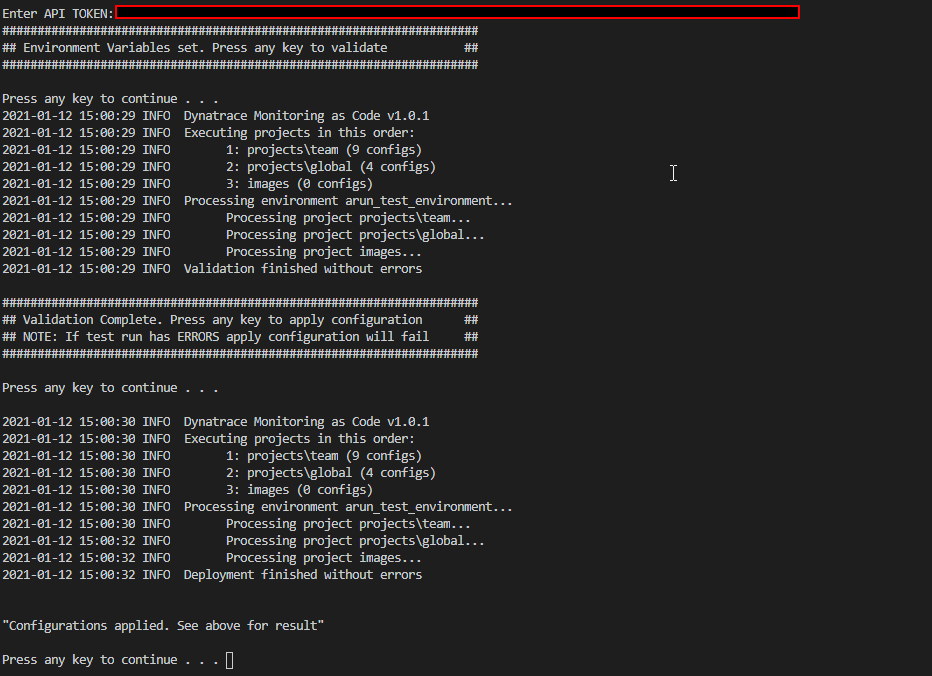

# Monaco Onboard: Quick onboard teams to Dynatrace

#### Note: This is not an official Dynatrace document. Please treat as such.

This script get teams to [Level 1](https://github.com/arunkrishnan-dt/Dynatrace-Maturity-Model#level-1-onboardstart-with-dynatrace-1) of [Dynatrace Maturity Model for Teams](https://github.com/arunkrishnan-dt/Dynatrace-Maturity-Model)

Use this script to quickly onboard teams to Dynatrace with team specific:
1. Auto-tags
2. Management Zone
3. Application
4. Application Detection Rules
5. Alerting Profile
6. Problem Notification (Email)
7. Synthetic Monitor - Browser & HTTP
8. Basic Health Dashboard

Note: Script also include best practise global `Process Group Naming` and `Service Naming` rules for microservices, but are disabled by default. Enable in `variables.ini` as required.

## Prerequisite - IMPORTANT!

Recommend setting following Host Properties per server.

```
application: <application_name> # Optional
team: <team_name>               # Mandatory
contact: <team_email>         # Optional
```
NOTE: This script REQUIRES `team` Host Property to be set on Servers to work.

### Options to set Host Properties:

   Option 1: During OneAgent install
   
    sudo /bin/sh Dynatrace-OneAgent-Linux-1.203.155.sh --set-host-group=[unique-host-group-name] --set-host-property=team=[team_-_name] --set-host-property=contact=[team_email] --set-host-property=application=[application_name]
    
         
   Option 2: Post OneAgent install using oneagentctl
     
    sudo /opt/dynatrace/oneagent/agent/tools/oneagentctl --set-host-group=[unique-host-group-name] --set-host-property=team=[team_-_name] --set-host-property=contact=[team_email] --set-host-property=application=[application_name]
    

Host Properties will appear as below once set:



## Requirements:
- Windows PC to run script
  
- Dynatrace API token with below permissions
  

- Specify Environment & Team specific varibles in `variables.ini` 

<br>

## Deploy:

Once Variables are specified in `variables.ini`, run `onboard.bat` to validate and apply configuration.

Pass `API_TOKEN` when prompted.



## References:
 [Dynatrace Monaco Repo](https://github.com/dynatrace-oss/dynatrace-monitoring-as-code)